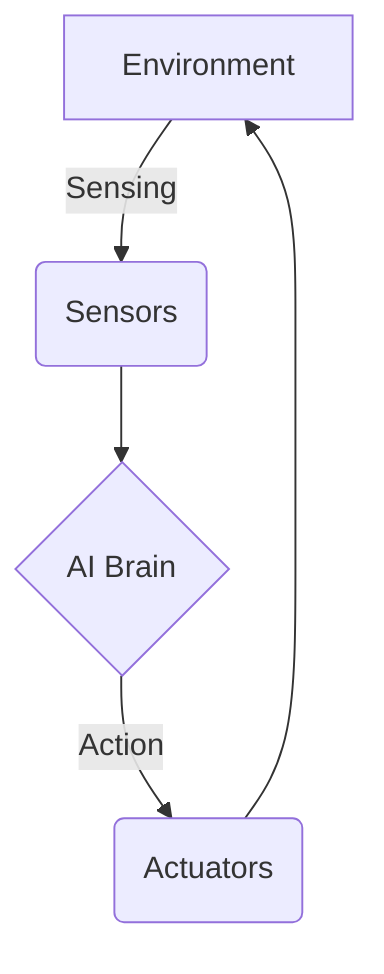

# Chapter 1: Foundations of Physical AI & Embodied Intelligence

Welcome to the exciting world of humanoid robotics! This chapter lays the groundwork for our journey by introducing the core concepts of physical AI and embodied intelligence.

## What is Physical AI?

Physical AI refers to artificial intelligence that interacts with the physical world through a body. Unlike disembodied AI, which exists purely in the digital realm (like chatbots or recommendation algorithms), physical AI can perceive its environment, move, and manipulate objects. This is the kind of AI that powers self-driving cars, delivery drones, and, of course, humanoid robots.

## Embodied vs. Disembodied AI

The key difference between embodied and disembodied AI is the presence of a physical body. This distinction is crucial because the body is not just a container for the AI's "brain"; it is an integral part of the intelligence itself. The shape, sensors, and actuators of a robot's body determine how it perceives and interacts with the world, which in turn shapes its intelligence.

### Components of an Embodied AI System

An embodied AI system typically consists of the following components:



- **Sensors**: These are the robot's "senses," allowing it to perceive its environment. Examples include cameras (vision), microphones (hearing), and tactile sensors (touch).
- **Actuators**: These are the robot's "muscles," enabling it to move and interact with the world. Examples include motors, servos, and hydraulic pistons.
- **AI Brain**: This is the robot's "mind," where it processes sensory information, makes decisions, and sends commands to the actuators.

### Timeline of Humanoid Robot Evolution

[Placeholder for a timeline diagram showing the evolution of humanoid robots, from early concepts to modern-day robots like Atlas and Asimo.]

## Key Challenges in Humanoid Robotics

Building intelligent humanoid robots is a monumental task that involves overcoming numerous challenges. Some of the most significant challenges include:

- **Bipedal Locomotion**: Walking on two legs is a complex balancing act that requires precise coordination and control.
- **Manipulation**: Grasping and manipulating objects with human-like dexterity is incredibly difficult.
- **Perception**: Understanding the world through noisy and incomplete sensory data is a major hurdle.
- **Human-Robot Interaction**: Designing robots that can safely and intuitively interact with humans is essential for their widespread adoption.

## Agent-Environment Interaction Loop

The interaction between an AI agent and its environment can be modeled as a simple loop:

1. The agent perceives the state of the environment through its sensors.
2. The agent's policy (its "brain") chooses an action based on the current state.
3. The agent executes the action using its actuators.
4. The environment transitions to a new state, and the agent receives a reward or penalty.

Here is a simple Python script that demonstrates this loop:

```python
import random

class Environment:
    def get_state(self):
        return "some_state"

    def take_action(self, action):
        print(f"Agent took action: {action}")
        return "new_state", random.choice([-1, 0, 1])

class Agent:
    def choose_action(self, state):
        print(f"Agent is in state: {state}")
        return "some_action"

if __name__ == "__main__":
    env = Environment()
    agent = Agent()

    state = env.get_state()
    for _ in range(3):
        action = agent.choose_action(state)
        new_state, reward = env.take_action(action)
        print(f"Agent received reward: {reward}")
        state = new_state
```

## What's Next?

In the next chapter, we will dive into the Robotic Nervous System with an introduction to ROS 2. We will also explore how the concepts of perception are further developed in Chapter 5.
