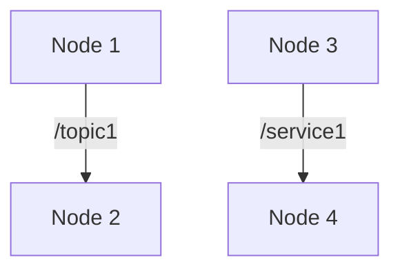

# Chapter 2: The Robotic Nervous System: An Introduction to ROS 2

This chapter introduces the Robot Operating System (ROS) 2, the backbone of many modern robotic systems.

## What is ROS 2?

ROS 2 is a set of software libraries and tools that help you build robot applications. It is not an operating system in the traditional sense, but a flexible framework for writing robot software.

## Core Concepts of ROS 2

The ROS 2 graph is the network of ROS 2 elements processing data together. It consists of:

- **Nodes**: A node is a process that performs computation.
- **Topics**: Nodes communicate with each other by publishing messages to topics.
- **Services**: A request/reply communication model.
- **Actions**: For long-running tasks, actions provide a way to send a request and receive feedback and a final result.



## Creating a ROS 2 Workspace

A workspace is a directory containing ROS 2 packages. Here's how you can create one:

```bash
# Create a new directory
mkdir -p ros2_ws/src

# Change into the directory
cd ros2_ws

# Build the workspace
colcon build
```

## Publisher-Subscriber System

A common communication pattern in ROS 2 is the publisher-subscriber model. One node publishes data to a topic, and another node subscribes to that topic to receive the data.

### Publisher Node

Here is a simple Python script for a ROS 2 publisher node:

```python
import rclpy
from rclpy.node import Node
from std_msgs.msg import String

class MyPublisher(Node):
    def __init__(self):
        super().__init__('my_publisher')
        self.publisher_ = self.create_publisher(String, 'topic', 10)
        timer_period = 0.5  # seconds
        self.timer = self.create_timer(timer_period, self.timer_callback)
        self.i = 0

    def timer_callback(self):
        msg = String()
        msg.data = f'Hello World: {self.i}'
        self.publisher_.publish(msg)
        self.get_logger().info(f'Publishing: "{msg.data}"')
        self.i += 1

def main(args=None):
    rclpy.init(args=args)
    my_publisher = MyPublisher()
    rclpy.spin(my_publisher)
    my_publisher.destroy_node()
    rclpy.shutdown()

if __name__ == '__main__':
    main()
```

### Subscriber Node

Here is a simple Python script for a ROS 2 subscriber node:

```python
import rclpy
from rclpy.node import Node
from std_msgs.msg import String

class MySubscriber(Node):
    def __init__(self):
        super().__init__('my_subscriber')
        self.subscription = self.create_subscription(
            String,
            'topic',
            self.listener_callback,
            10)
        self.subscription  # prevent unused variable warning

    def listener_callback(self, msg):
        self.get_logger().info(f'I heard: "{msg.data}"')

def main(args=None):
    rclpy.init(args=args)
    my_subscriber = MySubscriber()
    rclpy.spin(my_subscriber)
    my_subscriber.destroy_node()
    rclpy.shutdown()

if __name__ == '__main__':
    main()
```

## What's Next?

This chapter builds upon the concepts introduced in Chapter 1. In the next chapter, we will explore how to use ROS 2 with simulators like Gazebo.
