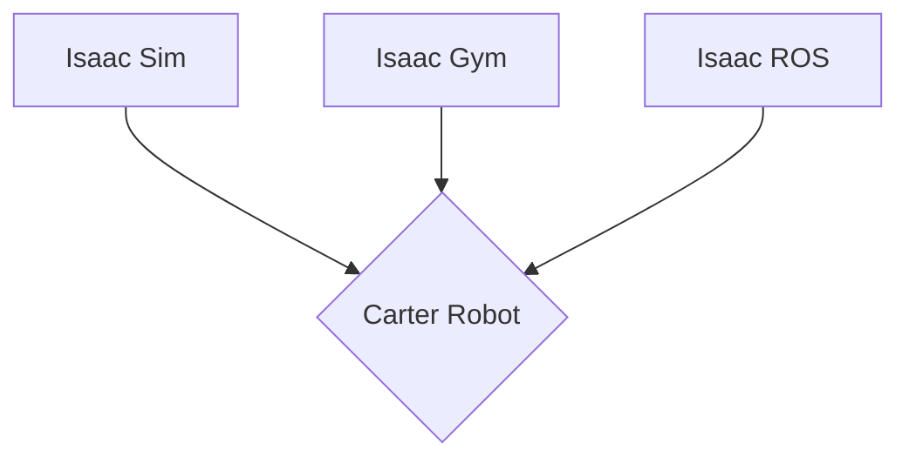

# Chapter 4: The Modern AI Stack: NVIDIA Isaac and Jetson

This chapter introduces the NVIDIA Isaac SDK, a powerful platform for developing AI-powered robots, and the Jetson platform for deploying AI at the edge.

## NVIDIA Isaac SDK

The NVIDIA Isaac SDK is a collection of tools, libraries, and pre-trained AI models that accelerate the development of robotics applications.

### Isaac Sim

Isaac Sim is a photorealistic robotics simulator that is part of the Isaac SDK. It is built on NVIDIA's Omniverse platform and provides a realistic environment for testing and training robots.

### Isaac SDK Architecture



## Building a Robotics Application with Isaac Sim

Here is a simple Python script for a robotics application in Isaac Sim:

```python
from omni.isaac.kit import SimulationApp

simulation_app = SimulationApp({"headless": False})

from omni.isaac.core import World
from omni.isaac.core.objects import VisualCuboid

world = World()
world.scene.add_default_ground_plane()
world.scene.add(
    VisualCuboid(
        prim_path="/new_cube_1",
        position=(0, 0, 1.0),
        name="visual_cube",
        size=1.0,
        color=(1.0, 0, 0),
    )
)

world.reset()

for i in range(500):
    world.step(render=True)

simulation_app.close()
```

## NVIDIA Jetson

NVIDIA Jetson is a series of small, powerful computers designed to run AI applications at the edge. These devices are ideal for deploying AI models on robots.

## What's Next?

This chapter builds upon the concepts introduced in Chapter 3. In the next chapter, we will dive into how AI models are used for perception.
