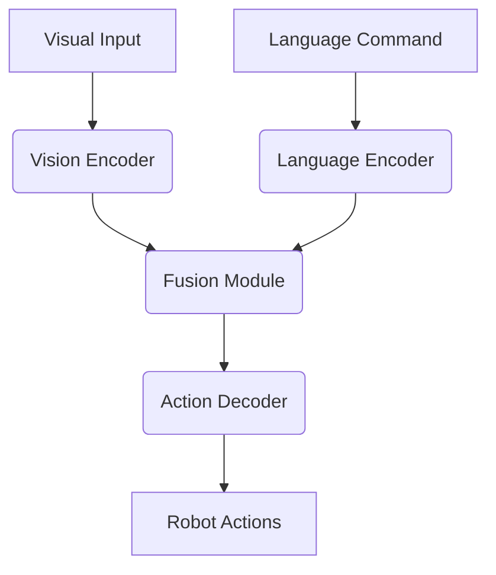

# Chapter 5: Perception: Vision-Language-Action Models

This chapter delves into Vision-Language-Action (VLA) models, a cutting-edge approach that allows robots to understand and interact with the world through a combination of visual perception, language comprehension, and physical action.

## Understanding VLA Models

VLA models are designed to bridge the gap between high-level human instructions and low-level robot control. They take visual inputs (e.g., camera feeds), language commands (e.g., "pick up the red block"), and translate them into a sequence of actions that the robot can execute.

## Architecture of a VLA Model

A typical VLA model architecture integrates several components:

-   **Vision Encoder**: Processes visual input to extract relevant features.
-   **Language Encoder**: Processes natural language commands to understand intent.
-   **Fusion Module**: Combines visual and language features.
-   **Action Decoder**: Generates a sequence of robot actions.



## VLA Models for Robot Perception and Control

VLA models enable robots to perform complex tasks by:

-   **Semantic Understanding**: Interpreting object names and relationships in the visual scene based on linguistic descriptions.
-   **Task Planning**: Decomposing high-level commands into achievable sub-goals and actions.
-   **Dynamic Adaptation**: Adjusting actions based on real-time sensory feedback and changing environmental conditions.

## Challenges in VLA Model Development

Developing and deploying robust VLA models presents several challenges:

-   **Data Scarcity**: Training VLA models requires vast amounts of multimodal data (vision, language, action).
-   **Generalization**: Models often struggle to generalize to novel objects, environments, or instructions not seen during training.
-   **Real-time Performance**: Executing complex VLA models on robotic hardware often requires significant computational resources and efficient inference.
-   **Safety and Reliability**: Ensuring that VLA-controlled robots operate safely and reliably in unstructured environments is paramount.

## Code Example: Simple VLA Task (Conceptual)

While a full VLA model is complex, here's a conceptual Python script demonstrating how a pre-trained VLA model might be used for a simple robotics task. This example assumes the existence of a `VLAModel` and `Robot` interface.

```python
import numpy as np

# Conceptual VLA Model Interface
class VLAModel:
    def __init__(self, model_path="pretrained_vla_model"):
        print(f"Loading VLA model from {model_path}...")
        # In a real scenario, load complex neural network here
        pass

    def predict_actions(self, image_features, natural_language_command):
        """
        Predicts a sequence of low-level robot actions based on visual and language inputs.
        Returns a list of conceptual actions.
        """
        print(f"Processing command: '{natural_language_command}' with visual input.")
        if "pick up red block" in natural_language_command.lower():
            return ["move_to_block(red)", "grasp()", "lift()"]
        elif "move forward" in natural_language_command.lower():
            return ["move_linear(0.1, 0, 0)"]
        else:
            return ["idle()"]

# Conceptual Robot Interface
class Robot:
    def __init__(self):
        print("Robot initialized.")
        self.position = np.array([0.0, 0.0, 0.0])

    def get_camera_feed(self):
        # Simulate getting image features from a camera
        print("Getting camera feed...")
        return {"object_colors": ["red", "blue", "green"], "object_positions": [(0.5, 0.2, 0.1)]}

    def execute_action(self, action):
        """Executes a single low-level robot action."""
        print(f"Executing robot action: {action}")
        if "move_to_block(red)" in action:
            self.position += np.array([0.5, 0.2, 0.1])
        elif "grasp()" in action:
            print("Gripper closed.")
        elif "lift()" in action:
            self.position[2] += 0.1
        elif "move_linear" in action:
            vec = eval("np.array(" + action.split('(')[1].split(')')[0] + ")")
            self.position += vec
        else:
            print("Unknown action.")

if __name__ == "__main__":
    vla_model = VLAModel()
    robot = Robot()

    # Simulate a VLA task
    visual_input = robot.get_camera_feed()
    command = "Pick up the red block"

    image_features = visual_input # Simplified, in reality this would be processed
    predicted_actions = vla_model.predict_actions(image_features, command)

    for action in predicted_actions:
        robot.execute_action(action)
    print(f"Robot final position: {robot.position}")

    command = "Move forward by 0.2 meters"
    predicted_actions = vla_model.predict_actions(image_features, command)
    for action in predicted_actions:
        robot.execute_action(action)
    print(f"Robot final position: {robot.position}")
```

## What's Next?

This chapter builds upon the concepts introduced in Chapter 4, especially regarding advanced AI models. In the next chapter, we will shift our focus to the physical movement capabilities of humanoid robots, specifically exploring Humanoid Kinematics and Locomotion.
