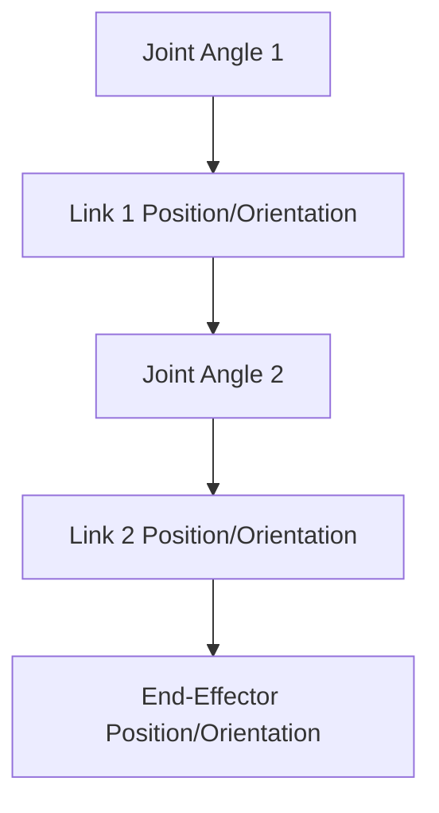

# Chapter 6: Movement: Humanoid Kinematics and Locomotion

This chapter delves into the fundamental principles governing the movement of humanoid robots, focusing on kinematics and locomotion.

## Kinematics

Kinematics is the study of motion without considering the forces that cause it. In robotics, it primarily deals with the spatial arrangement of the robot's links and joints.

### Forward Kinematics

Forward kinematics calculates the position and orientation of the robot's end-effector (e.g., a hand) given the angles of its joints.



Here's a simple Python script demonstrating forward kinematics for a 2-DOF (Degrees of Freedom) robotic arm:

```python
import numpy as np

def forward_kinematics_2dof(l1, l2, theta1_deg, theta2_deg):
    """
    Calculates the end-effector position for a 2-DOF planar robotic arm.

    Args:
        l1 (float): Length of the first link.
        l2 (float): Length of the second link.
        theta1_deg (float): Angle of the first joint in degrees.
        theta2_deg (float): Angle of the second joint in degrees.

    Returns:
        tuple: (x, y) coordinates of the end-effector.
    """
    theta1_rad = np.deg2rad(theta1_deg)
    theta2_rad = np.deg2rad(theta2_deg)

    x = l1 * np.cos(theta1_rad) + l2 * np.cos(theta1_rad + theta2_rad)
    y = l1 * np.sin(theta1_rad) + l2 * np.sin(theta1_rad + theta2_rad)
    return x, y

if __name__ == "__main__":
    link1_length = 1.0  # meters
    link2_length = 0.8  # meters
    joint1_angle = 30   # degrees
    joint2_angle = 60   # degrees

    x_ee, y_ee = forward_kinematics_2dof(link1_length, link2_length, joint1_angle, joint2_angle)
    print(f"End-effector position: x={x_ee:.2f}m, y={y_ee:.2f}m")

    joint1_angle_new = 90
    joint2_angle_new = -45
    x_ee_new, y_ee_new = forward_kinematics_2dof(link1_length, link2_length, joint1_angle_new, joint2_angle_new)
    print(f"New end-effector position: x={x_ee_new:.2f}m, y={y_ee_new:.2f}m")
```

### Inverse Kinematics

Inverse kinematics solves the opposite problem: given a desired end-effector position and orientation, what are the joint angles required to achieve it? This is often more complex and can have multiple solutions or no solutions.

## Humanoid Locomotion

Humanoid locomotion, specifically bipedal walking, is a highly complex task due to the inherent instability of a two-legged stance.

### Common Locomotion Strategies

-   **Zero-Moment Point (ZMP)**: A widely used concept for achieving stable walking by ensuring that the robot's center of pressure remains within its support polygon.
-   **Pattern Generators**: Pre-computed or learned joint trajectories that produce walking motions.
-   **Model Predictive Control (MPC)**: Optimizing future movements based on current state and a predictive model of the robot's dynamics.

### Humanoid Gaits

[Placeholder for a diagram showing different humanoid gaits (e.g., walking, running).]

### Conceptual ZMP Calculation

Here's a conceptual Python script illustrating a basic zero-moment point (ZMP) calculation for stability:

```python
import numpy as np

def calculate_zmp_1d(mass, com_pos, com_acc, gravity):
    """
    Conceptual 1D ZMP calculation.
    ZMP = Center of Mass Position - (CoM Acceleration * CoM Height / Gravity)
    This is a highly simplified 1D model for illustration.

    Args:
        mass (float): Total mass of the robot.
        com_pos (float): Center of mass position (x-coordinate).
        com_acc (float): Center of mass acceleration (x-coordinate).
        gravity (float): Acceleration due to gravity.

    Returns:
        float: The calculated ZMP position (x-coordinate).
    """
    # Assuming CoM height is constant and embedded within the formula for simplicity
    # In reality, ZMP calculation involves more complex dynamics
    zmp = com_pos - (com_acc / gravity) # Simplified for conceptual understanding
    return zmp

if __name__ == "__main__":
    robot_mass = 50.0 # kg
    com_x_position = 0.1 # meters
    com_x_acceleration = 0.5 # m/s^2
    g = 9.81 # m/s^2

    current_zmp = calculate_zmp_1d(robot_mass, com_x_position, com_x_acceleration, g)
    print(f"Calculated ZMP (1D): {current_zmp:.2f}m")

    # If ZMP is outside the support polygon, the robot is unstable.
    # For a simple foot, support polygon might be [-0.1m, 0.1m]
    support_polygon_min = -0.1
    support_polygon_max = 0.1

    if support_polygon_min <= current_zmp <= support_polygon_max:
        print("Robot is stable (ZMP within support polygon).")
    else:
        print("Robot is unstable (ZMP outside support polygon).")
```

## What's Next?

This chapter builds upon our understanding of how VLA models perceive the world from Chapter 5. In the next chapter, we will focus on how robots interact with objects, exploring Manipulation: Grasping and Interaction.
