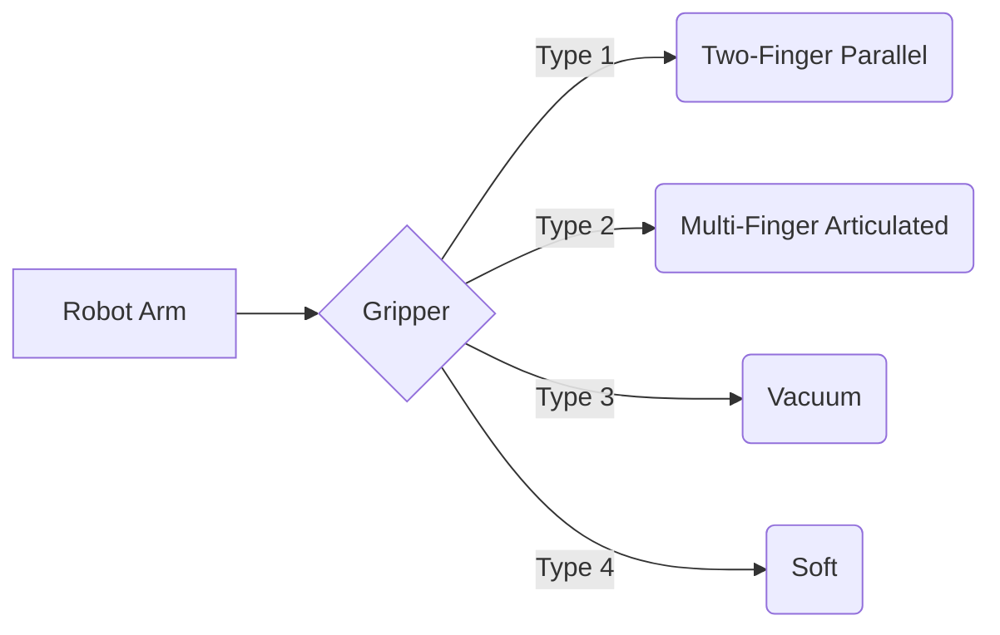
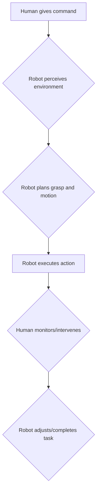

# Chapter 7: Manipulation: Grasping and Interaction

This chapter explores the intricate world of robotic manipulation, focusing on how humanoid robots interact with objects through grasping and how they can safely and effectively collaborate with humans.

## Robot Grippers and End-Effectors

The "hand" of a robot is called an end-effector or gripper. Different tasks require different types of grippers:

-   **Two-Finger Parallel Grippers**: Common for simple pick-and-place tasks.
-   **Multi-Finger Articulated Hands**: Mimic human hands for greater dexterity and ability to grasp complex shapes.
-   **Vacuum Grippers**: Ideal for flat, smooth objects.
-   **Soft Grippers**: Conform to the shape of irregular or delicate objects.



## Grasping Strategies

Successful grasping involves more than just closing a gripper around an object. It requires a strategy:

-   **Power Grasp**: Maximizes contact area and friction for a secure hold, typically used for heavy or oddly shaped objects.
-   **Precision Grasp**: Uses fingertips to manipulate small objects with fine control, similar to how humans hold a pen.
-   **Form Closure**: The gripper's geometry completely encloses the object, preventing it from escaping regardless of friction.
-   **Force Closure**: Requires friction and contact forces to hold the object securely.

## Human-Robot Interaction (HRI) for Manipulation

For humanoid robots to be truly useful, they must be able to work alongside humans. This requires robust Human-Robot Interaction (HRI) principles:

-   **Safety**: Ensuring the robot does not harm the human, even in unexpected situations. This involves collision detection, force limiting, and safe motion planning.
-   **Communication**: Clear and intuitive ways for humans and robots to communicate intentions and states (e.g., gestures, voice commands, visual cues).
-   **Trust**: Humans need to trust that the robot will perform its tasks reliably and safely.

### Human-Robot Collaborative Task Flow



## Code Example: Conceptual Grasping Algorithm

Here's a conceptual Python script demonstrating a simple grasping algorithm based on object shape. This example simplifies many complexities but illustrates the logic.

```python
class Object:
    def __init__(self, shape, size, fragile=False):
        self.shape = shape
        self.size = size
        self.fragile = fragile

class Gripper:
    def __init__(self, gripper_type="two_finger", max_force=100):
        self.gripper_type = gripper_type
        self.max_force = max_force
        self.is_open = True

    def open_gripper(self):
        self.is_open = True
        print("Gripper open.")

    def close_gripper(self, force=50):
        if force > self.max_force:
            print(f"Warning: Force {force} exceeds max force {self.max_force}.")
            force = self.max_force
        self.is_open = False
        print(f"Gripper closed with force: {force}.")

class GraspingAlgorithm:
    def __init__(self, robot_gripper):
        self.gripper = robot_gripper

    def simple_grasp(self, target_object):
        print(f"Attempting to grasp a {target_object.shape} object.")
        self.gripper.open_gripper()

        # Simulate moving to object
        print(f"Moving to position of {target_object.shape}.")
        
        grasp_force = 50
        if target_object.fragile:
            grasp_force = 20 # Use less force for fragile objects

        if target_object.shape == "sphere" or target_object.shape == "cylinder":
            # For round objects, a power grasp might be good
            print("Using power grasp strategy.")
            self.gripper.close_gripper(grasp_force)
        elif target_object.shape == "box":
            # For box-like objects, a parallel grasp might suffice
            print("Using precision grasp strategy.")
            self.gripper.close_gripper(grasp_force)
        else:
            print("Unknown object shape, attempting generic grasp.")
            self.gripper.close_gripper(grasp_force)
        
        if not self.gripper.is_open:
            print(f"Successfully grasped the {target_object.shape}.")
            return True
        else:
            print(f"Failed to grasp the {target_object.shape}.")
            return False

if __name__ == "__main__":
    my_gripper = Gripper(gripper_type="multi_finger", max_force=80)
    grasp_planner = GraspingAlgorithm(my_gripper)

    sphere_obj = Object(shape="sphere", size=0.1)
    box_obj = Object(shape="box", size=0.2, fragile=True)

    grasp_planner.simple_grasp(sphere_obj)
    my_gripper.open_gripper()
    print("-" * 20)
    grasp_planner.simple_grasp(box_obj)
    my_gripper.open_gripper()
```

## What's Next?

This chapter built upon the movement capabilities explored in Chapter 6. Our understanding of how robots interact physically will now lead us to explore how they interact intelligently. In the next chapter, we will delve into the realm of Conversational AI and Task Planning.
