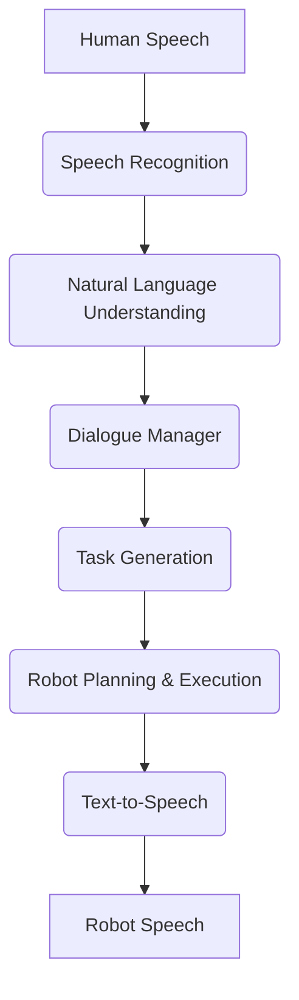
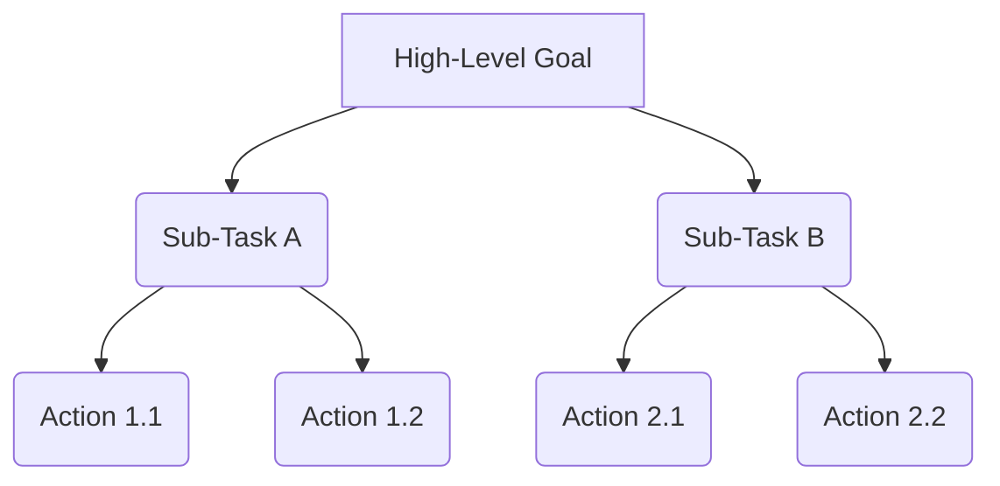

# Chapter 8: Intelligence: Conversational AI and Task Planning

This chapter explores how humanoid robots can move beyond simple pre-programmed actions to engage in natural language conversations and perform complex, goal-oriented task planning.

## Conversational AI in Robotics

Conversational AI allows robots to understand human language, process requests, and respond in a natural and intelligent manner. This is crucial for intuitive human-robot interaction.

### Conversational AI Pipeline for a Robot



## Task Planning and Execution

Task planning enables robots to break down high-level goals into a sequence of executable actions. For humanoid robots, this often involves considering their physical capabilities and the environment.

### Hierarchical Task Planning

A common approach is hierarchical task planning, where high-level tasks are decomposed into smaller, more manageable sub-tasks.



### Challenges of Integrating Conversational AI with Physical Actions

-   **Grounding**: Connecting abstract linguistic concepts to concrete physical actions and perceptions.
-   **Context Management**: Maintaining a coherent understanding of the conversation and the robot's environment.
-   **Ambiguity Resolution**: Dealing with vague or incomplete human commands.
-   **Real-time Performance**: Ensuring timely responses and actions to maintain natural interaction flow.

## Code Example: Simple Conversational Agent (Conceptual)

Here's a conceptual Python script demonstrating a simple conversational agent's interaction. This simplified example focuses on intent recognition and response generation.

```python
class ConversationalAgent:
    def __init__(self):
        self.knowledge_base = {
            "hello": "Hello! How can I help you?",
            "move": "Which direction and how far?",
            "pick up": "What would you like me to pick up?",
            "status": "I am currently awaiting your command.",
            "bye": "Goodbye! Have a great day."
        }

    def process_command(self, command):
        command = command.lower()
        if "hello" in command:
            return self.knowledge_base["hello"]
        elif "move" in command:
            return self.knowledge_base["move"]
        elif "pick up" in command:
            return self.knowledge_base["pick up"]
        elif "status" in command:
            return self.knowledge_base["status"]
        elif "bye" in command:
            return self.knowledge_base["bye"]
        else:
            return "I'm sorry, I don't understand that command."

if __name__ == "__main__":
    agent = ConversationalAgent()
    print("Robot: " + agent.process_command("Hello there!"))
    print("Robot: " + agent.process_command("Can you move forward?"))
    print("Robot: " + agent.process_command("What is your current status?"))
    print("Robot: " + agent.process_command("Please sing a song."))
    print("Robot: " + agent.process_command("Bye bye!"))
```

## What's Next?

This chapter provided insights into how robots can understand and plan. Building on this intelligence, the next chapter will introduce the critical field of Robot Learning, where robots improve their performance through experience.
