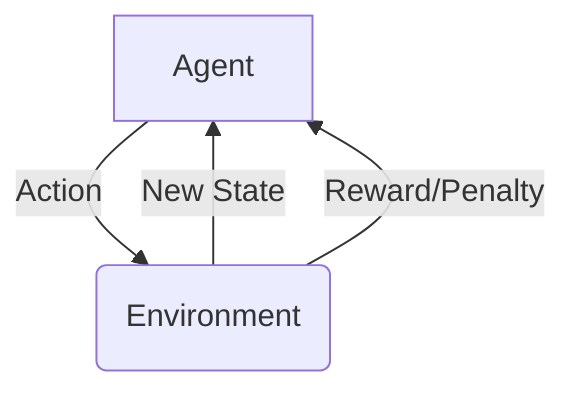
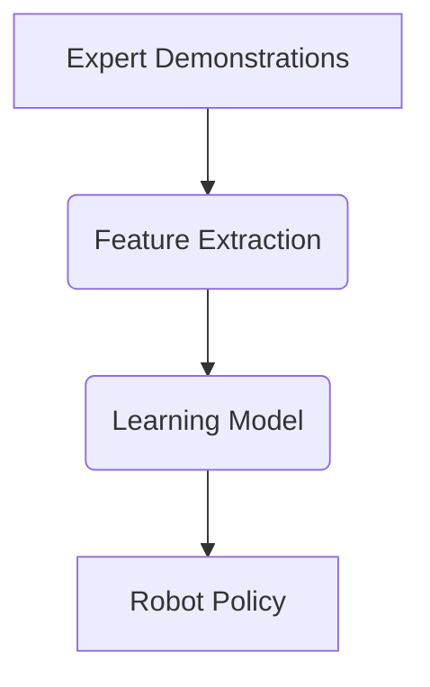

# Chapter 9: Introduction to Robot Learning

This chapter introduces the exciting field of robot learning, where robots acquire new skills and improve their performance through experience, rather than explicit programming.

## Basic Principles of Robot Learning

Robot learning combines principles from robotics, machine learning, and artificial intelligence to enable robots to:

-   **Adapt**: Adjust their behavior to new environments or tasks.
-   **Automate**: Learn complex behaviors that are difficult to hand-code.
-   **Improve**: Refine their skills over time through practice and feedback.

## Learning Paradigms

Several key paradigms drive robot learning:

### Reinforcement Learning (RL)

In reinforcement learning, a robot (agent) learns by interacting with its environment, receiving rewards for desired behaviors and penalties for undesired ones. The goal is to maximize cumulative reward over time.



#### Conceptual RL Agent (Q-learning)

Here's a conceptual Python script demonstrating a simple Q-learning agent for a basic robot task (e.g., navigating a grid).

```python
import numpy as np

class GridWorld:
    def __init__(self, size=5, start=(0,0), goal=(4,4)):
        self.size = size
        self.state = start
        self.goal = goal
        self.actions = {'up': (-1, 0), 'down': (1, 0), 'left': (0, -1), 'right': (0, 1)}

    def reset(self):
        self.state = (0,0)
        return self.state

    def step(self, action_name):
        action_vec = self.actions[action_name]
        next_state = (self.state[0] + action_vec[0], self.state[1] + action_vec[1])

        # Keep agent within bounds
        next_state = (max(0, min(self.size - 1, next_state[0])),
                      max(0, min(self.size - 1, next_state[1])))
        
        self.state = next_state
        
        reward = -0.1 # Small penalty for each step
        done = False
        if self.state == self.goal:
            reward = 10.0
            done = True
        
        return self.state, reward, done

class QLearningAgent:
    def __init__(self, env, alpha=0.1, gamma=0.9, epsilon=0.1):
        self.env = env
        self.q_table = {} # (state, action) -> Q-value
        self.alpha = alpha # Learning rate
        self.gamma = gamma # Discount factor
        self.epsilon = epsilon # Exploration-exploitation trade-off

    def get_q_value(self, state, action):
        return self.q_table.get((state, action), 0.0)

    def choose_action(self, state):
        if np.random.uniform(0, 1) < self.epsilon:
            return np.random.choice(list(self.env.actions.keys())) # Explore
        else:
            q_values = {action: self.get_q_value(state, action) for action in self.env.actions.keys()}
            max_q = max(q_values.values())
            # Choose randomly among actions with max Q-value
            best_actions = [action for action, q in q_values.items() if q == max_q]
            return np.random.choice(best_actions) # Exploit

    def learn(self, state, action, reward, next_state):
        old_q = self.get_q_value(state, action)
        
        # Max Q-value for next_state
        next_q_values = [self.get_q_value(next_state, a) for a in self.env.actions.keys()]
        max_next_q = max(next_q_values) if next_q_values else 0.0

        new_q = old_q + self.alpha * (reward + self.gamma * max_next_q - old_q)
        self.q_table[(state, action)] = new_q

if __name__ == "__main__":
    env = GridWorld()
    agent = QLearningAgent(env)

    num_episodes = 100
    print(f"Training Q-Learning agent for {num_episodes} episodes...")

    for episode in range(num_episodes):
        state = env.reset()
        done = False
        total_reward = 0
        while not done:
            action = agent.choose_action(state)
            next_state, reward, done = env.step(action)
            agent.learn(state, action, reward, next_state)
            state = next_state
            total_reward += reward
        
        if (episode + 1) % 20 == 0:
            print(f"Episode {episode + 1}: Total Reward = {total_reward:.2f}")

    print("\nTraining complete. Learned Q-table (sample):")
    for (s, a), q in list(agent.q_table.items())[:10]: # Print first 10 entries
        print(f"  Q({s}, {a}) = {q:.2f}")
```

### Imitation Learning (IL)

Imitation learning (also known as Learning from Demonstration) involves a robot learning a skill by observing a human or expert performing the task. The robot tries to mimic the expert's behavior.



## Scenarios for Robot Learning

Robot learning is particularly effective in scenarios where:

-   The task is complex and difficult to program manually (e.g., opening a door with an unknown handle).
-   The environment is unstructured and dynamic (e.g., navigating a cluttered room).
-   The robot needs to adapt to user preferences or changing requirements.

## What's Next?

This chapter laid the foundation for how robots can learn from experience. In the next chapter, we will address the crucial considerations of Ethics and Safety in Humanoid Robotics.
