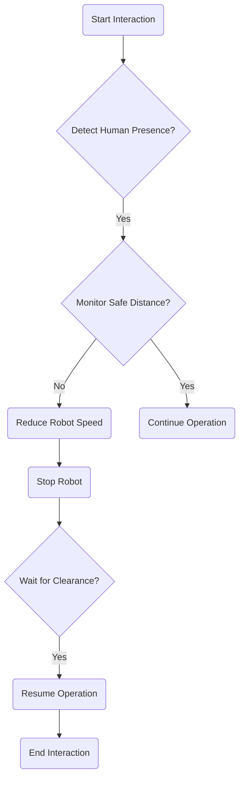

# Chapter 10: Ethics and Safety in Humanoid Robotics

As humanoid robots become more sophisticated and integrated into society, addressing the ethical implications and ensuring their safe operation becomes paramount. This chapter explores these critical considerations.

## Ethical Dilemmas in Humanoid Robotics

The rise of humanoid robots brings forth a unique set of ethical challenges:

-   **Autonomy and Control**: To what extent should robots make independent decisions, especially in situations with moral consequences?
-   **Responsibility and Accountability**: Who is responsible when a robot causes harm? The designer, the operator, or the robot itself?
-   **Privacy and Surveillance**: Robots equipped with advanced sensors can collect vast amounts of data, raising concerns about privacy.
-   **Impact on Employment**: The increasing capabilities of robots could lead to job displacement in various sectors.
-   **Human Dignity and Relationships**: How might close interaction with humanoid robots affect human perception of dignity, empathy, and social relationships?

### Framework for Ethical Decision-Making in AI

```mermaid
graph TD;
    A[Identify Ethical Issue] --> B{Gather Information};
    B --> C{Consider Stakeholders};
    C --> D{Explore Options};
    D --> E{Evaluate Options (Ethical Principles)};
    E --> F[Make Decision];
    F --> G[Implement and Reflect];
```

## Design Principles and Engineering Practices for Robot Safety

Safety must be a core design principle for any robot interacting with humans:

-   **Fail-Safe Mechanisms**: Designing systems to revert to a safe state in case of failure.
-   **Physical Safety**: Using soft materials, limiting force/speed, and incorporating emergency stop buttons.
-   **Predictable Behavior**: Robots should behave in a way that is understandable and predictable to humans.
-   **Transparency**: Robots should be able to explain their actions and intentions when necessary.

### Safety Protocols for Human-Robot Interaction



## Regulatory Frameworks and Societal Impacts

Governments and international bodies are beginning to develop regulations for robotics and AI. These frameworks aim to ensure safety, protect privacy, and address societal impacts.

## Code Example: Simple Safety Check (Conceptual)

This conceptual Python script demonstrates a basic safety check, where a robot might stop if a human is detected too close.

```python
import time

class RobotSafetySystem:
    def __init__(self, safe_distance=1.0):
        self.safe_distance = safe_distance
        self.human_present = False
        self.robot_operating = False

    def detect_human(self, distance_to_human):
        if distance_to_human < self.safe_distance:
            print(f"Human detected within {self.safe_distance}m! Distance: {distance_to_human:.2f}m")
            self.human_present = True
        else:
            self.human_present = False

    def operate_robot(self):
        if not self.robot_operating:
            print("Robot starting operation...")
            self.robot_operating = True

        while self.robot_operating:
            # Simulate robot doing work
            print("Robot operating safely...")
            
            # Simulate sensor reading
            simulated_distance = 2.0 # Assume human is far
            if time.time() % 10 < 2: # Simulate human approaching every 10 seconds
                simulated_distance = 0.5
            
            self.detect_human(simulated_distance)
            
            if self.human_present:
                self.stop_robot()
            
            time.sleep(1)

    def stop_robot(self):
        if self.robot_operating:
            print("WARNING: Stopping robot due to safety protocol!")
            self.robot_operating = False
            self.wait_for_clearance()

    def wait_for_clearance(self):
        print("Waiting for human to clear safe zone...")
        while self.human_present:
            # In a real system, this would involve continuous sensor monitoring
            # For simulation, just wait a bit
            time.sleep(1)
            self.detect_human(2.0) # Simulate human moving away
        print("Safe zone clear. Ready to resume.")

if __name__ == "__main__":
    safety_system = RobotSafetySystem(safe_distance=1.0)
    safety_system.operate_robot()
```

## What's Next?

This chapter highlighted the crucial responsibility in developing humanoid robots. Building on the understanding of movement, our next focus will be on even more complex physical capabilities. In Chapter 11, we will explore Advanced Locomotion, specifically Bipedal Walking and Dynamic Control.
