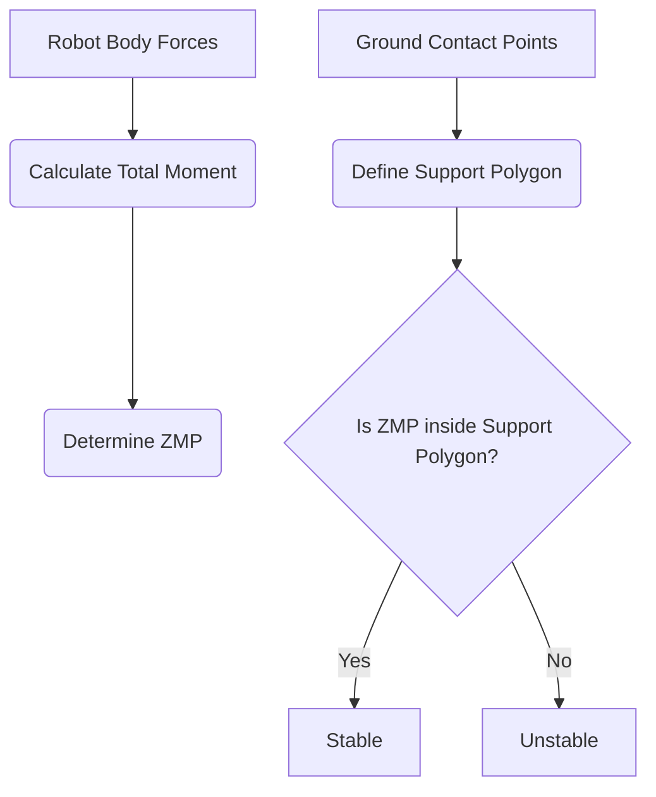

# Chapter 11: Advanced Locomotion: Bipedal Walking and Dynamic Control

Building upon our understanding of basic kinematics and locomotion, this chapter dives into the sophisticated techniques required for stable and efficient bipedal walking in humanoid robots, emphasizing dynamic control.

## Principles of Dynamic Balance and Stability

Achieving stable walking for a bipedal robot is inherently challenging due to its dynamic instability. Key concepts for understanding and controlling this include:

-   **Zero Moment Point (ZMP)**: The point on the ground where the total moment of all forces (gravity, inertia) acting on the robot is zero. Keeping the ZMP within the support polygon (the area defined by the robot's feet in contact with the ground) is crucial for static and dynamic stability.

-   **Center of Mass (CoM)**: The average position of all the mass in the robot. Its trajectory is vital for controlling balance.

-   **Angular Momentum**: Essential for maintaining balance during walking, especially in dynamic motions.

### Zero Moment Point (ZMP) in 3D



## Advanced Control Strategies

To achieve robust bipedal walking, humanoid robots employ advanced control strategies:

-   **Whole-Body Control (WBC)**: A control framework that simultaneously coordinates all the robot's joints and end-effectors to achieve a desired task while respecting physical constraints (e.g., balance, joint limits).

    ### Whole-Body Control Architecture

    ```mermaid
    graph TD;
        A[Desired Tasks (e.g., walk, balance)] --> B(Task Prioritization);
        B --> C(Inverse Kinematics/Dynamics Solver);
        C --> D[Joint Torques/Positions];
        D --> E(Robot Actuators);
        E --> F[Robot State (Sensors)];
        F --> A;
    ```

-   **Inverse Dynamics**: Calculates the joint torques required to achieve a desired motion, taking into account the robot's mass, inertia, and external forces.

-   **Model Predictive Control (MPC)**: Uses a predictive model of the robot's dynamics to optimize future control inputs over a short horizon, constantly re-planning as the robot moves.

## Challenges in Robust Bipedal Walking

-   **Varied Terrain**: Walking on uneven surfaces, stairs, or slippery ground significantly increases complexity.
-   **Perturbations**: Maintaining balance when subjected to external pushes or disturbances.
-   **Energy Efficiency**: Designing gaits that are not only stable but also energy-efficient for extended operation.
-   **Computational Load**: Real-time execution of complex dynamic control algorithms requires powerful onboard computing.

## Code Example: Conceptual Dynamic Walking Controller (Simplified Inverted Pendulum)

This highly simplified Python script illustrates the conceptual idea behind controlling a bipedal robot's balance using an inverted pendulum model, which is often a building block for dynamic walking.

```python
import numpy as np
import matplotlib.pyplot as plt

# Simplified Inverted Pendulum Model for Bipedal Control
class InvertedPendulum:
    def __init__(self, mass=1.0, height=1.0, dt=0.01, g=9.81):
        self.mass = mass # Mass of the robot
        self.height = height # Height of the CoM
        self.dt = dt # Time step
        self.g = g # Gravity
        
        # State: [CoM_x, CoM_x_dot]
        self.state = np.array([0.0, 0.0]) # Initial CoM position and velocity

    def update_state(self, u=0.0):
        """
        Updates the CoM state based on the ZMP (u)
        u represents the ZMP position (control input)
        """
        CoM_x, CoM_x_dot = self.state
        
        # Inverted pendulum dynamics (linearized around upright position)
        CoM_x_ddot = (self.g / self.height) * (CoM_x - u)
        
        CoM_x_dot_new = CoM_x_dot + CoM_x_ddot * self.dt
        CoM_x_new = CoM_x + CoM_x_dot * self.dt + 0.5 * CoM_x_ddot * self.dt**2
        
        self.state = np.array([CoM_x_new, CoM_x_dot_new])
        return self.state

def generate_zmp_trajectory(t_total, dt, step_length=0.2, num_steps=5):
    """Generates a simple alternating ZMP trajectory for walking."""
    time_points = np.arange(0, t_total, dt)
    zmp_trajectory = np.zeros_like(time_points)
    
    # Simple step pattern: alternate ZMP between -step_length/2 and +step_length/2
    step_duration = t_total / num_steps
    for i in range(num_steps):
        start_idx = int(i * step_duration / dt)
        end_idx = int((i + 1) * step_duration / dt)
        
        if i % 2 == 0: # Left foot support
            zmp_trajectory[start_idx:end_idx] = -step_length / 2
        else: # Right foot support
            zmp_trajectory[start_idx:end_idx] = step_length / 2
            
    return time_points, zmp_trajectory

if __name__ == "__main__":
    pendulum = InvertedPendulum()
    
    total_simulation_time = 5.0 # seconds
    time_steps, zmp_input = generate_zmp_trajectory(total_simulation_time, pendulum.dt)

    com_x_history = []
    
    for i, t in enumerate(time_steps):
        current_zmp = zmp_input[i]
        com_x, _ = pendulum.update_state(current_zmp)
        com_x_history.append(com_x)
    
    plt.figure(figsize=(10, 6))
    plt.plot(time_steps, com_x_history, label='CoM X Position')
    plt.plot(time_steps, zmp_input, label='Desired ZMP X Position', linestyle='--')
    plt.xlabel('Time (s)')
    plt.ylabel('Position (m)')
    plt.title('Conceptual Bipedal Walking: CoM vs. ZMP (Simplified Inverted Pendulum)')
    plt.legend()
    plt.grid(True)
    plt.show()
```

## What's Next?

This chapter provided deep insights into controlling humanoid movement. This understanding of advanced locomotion techniques sets the stage for our final challenge. In Chapter 12, we will bring all concepts together in the Capstone Project: Building an Autonomous Humanoid.
