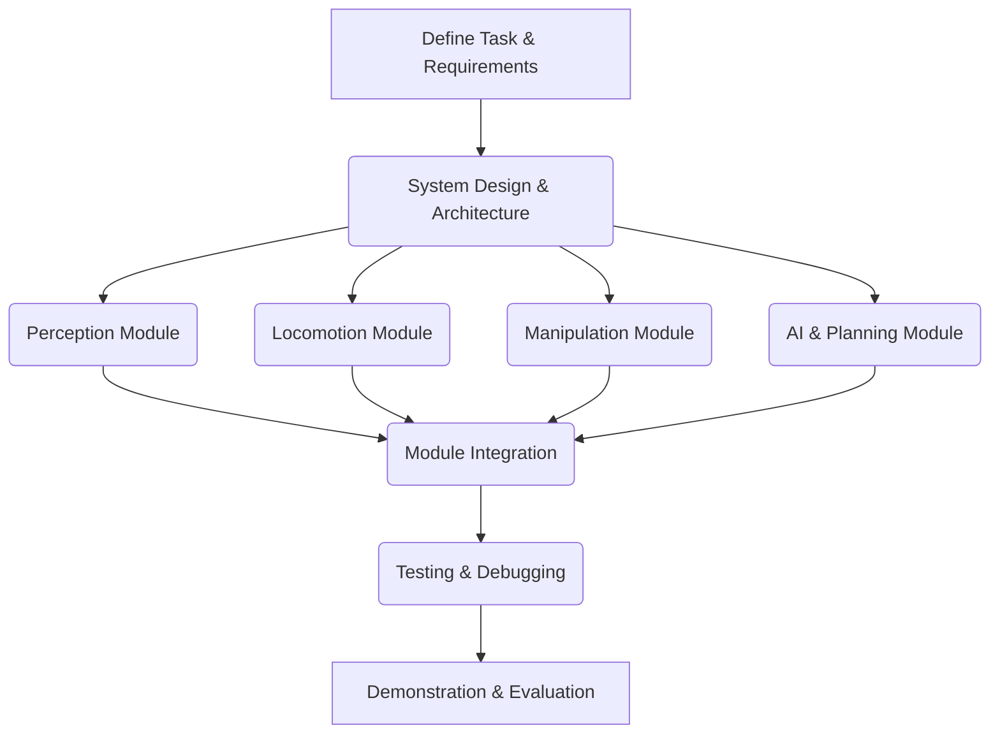

# Chapter 12: Capstone Project: Building an Autonomous Humanoid

This capstone project serves as the culmination of your journey through this book, challenging you to integrate all the knowledge and skills acquired to build a functional autonomous humanoid robot system.

## Project Goal

Design, implement, and demonstrate an autonomous humanoid robot performing a defined task. This task can be a simplified version of a real-world application, such as:

-   Navigating a small obstacle course.
-   Picking up and placing a specific object.
-   Responding to simple voice commands to perform an action.

## Project Workflow

The capstone project will follow a structured workflow, emphasizing modular development and integration.



## System Architecture

A high-level system architecture for your autonomous humanoid robot might include:

-   **Sensors**: Cameras, depth sensors, IMUs for perception and state estimation.
-   **Computation**: Onboard computer (e.g., NVIDIA Jetson) for AI models and control.
-   **Actuators**: Motors and servos for locomotion and manipulation.
-   **Software Framework**: ROS 2 for inter-module communication.
-   **AI/Decision-Making**: VLA models, task planners, reinforcement learning agents.

## Code Examples: Modular Components Interacting

While the full project code is extensive, here are conceptual snippets demonstrating how different modules might interact.

### Perception Module (Conceptual)

```python
# perception_node.py
import rclpy
from rclpy.node import Node
from sensor_msgs.msg import Image
from cv_bridge import CvBridge
import cv2

class PerceptionNode(Node):
    def __init__(self):
        super().__init__('perception_node')
        self.subscription = self.create_subscription(
            Image,
            '/camera/image_raw',
            self.image_callback,
            10
        )
        self.publisher = self.create_publisher(
            String, # Assuming a simplified string output for detected object
            '/robot/detected_object',
            10
        )
        self.bridge = CvBridge()
        self.get_logger().info('Perception node started.')

    def image_callback(self, msg):
        try:
            cv_image = self.bridge.imgmsg_to_cv2(msg, "bgr8")
            # Perform object detection (simplified)
            detected_object = "red_block" # Placeholder
            self.publisher.publish(String(data=detected_object))
            self.get_logger().info(f"Detected: {detected_object}")
        except Exception as e:
            self.get_logger().error(f"Error processing image: {e}")

def main(args=None):
    rclpy.init(args=args)
    node = PerceptionNode()
    rclpy.spin(node)
    node.destroy_node()
    rclpy.shutdown()

if __name__ == '__main__':
    main()
```

### Task Planning Module (Conceptual)

```python
# planner_node.py
import rclpy
from rclpy.node import Node
from std_msgs.msg import String

class PlannerNode(Node):
    def __init__(self):
        super().__init__('planner_node')
        self.subscription = self.create_subscription(
            String,
            '/robot/detected_object',
            self.detected_object_callback,
            10
        )
        self.publisher = self.create_publisher(
            String, # Simplified command string
            '/robot/command',
            10
        )
        self.get_logger().info('Planner node started.')
        self.current_goal = "pick_red_block" # Example goal

    def detected_object_callback(self, msg):
        detected_object = msg.data
        if detected_object == "red_block" and self.current_goal == "pick_red_block":
            self.get_logger().info("Red block detected. Planning grasp.")
            self.publisher.publish(String(data="grasp_red_block"))
            self.current_goal = "place_red_block" # Next step
        elif detected_object == "green_platform" and self.current_goal == "place_red_block":
            self.get_logger().info("Green platform detected. Planning placement.")
            self.publisher.publish(String(data="place_on_green_platform"))
            self.current_goal = "done"
        
def main(args=None):
    rclpy.init(args=args)
    node = PlannerNode()
    rclpy.spin(node)
    node.destroy_node()
    rclpy.shutdown()

if __name__ == '__main__':
    main()
```

## Project Setup Files

Your capstone project will likely involve standard robotics project setup. For ROS 2, this includes:

-   `package.xml`: Defines metadata for your ROS 2 package.
-   `setup.py` (for Python packages): Defines how your Python nodes are built and installed.
-   `CMakeLists.txt` (for C++ packages): Defines how your C++ nodes are built.

Example `package.xml`:

```xml
<?xml version="1.0"?>
<?xml-model href="http://download.ros.org/schema/package_format3.xsd" schematypens="http://www.w3.org/2001/XMLSchema"?>
<package format="3">
  <name>capstone_robot</name>
  <version>0.0.0</version>
  <description>Capstone project for autonomous humanoid robot</description>
  <maintainer email="user@example.com">Your Name</maintainer>
  <license>Apache License 2.0</license>

  <depend>rclpy</depend>
  <depend>std_msgs</depend>
  <depend>sensor_msgs</depend>
  <depend>cv_bridge</depend>

  <test_depend>ament_copyright</test_depend>
  <test_depend>ament_flake8</test_depend>
  <test_depend>ament_pep257</test_depend>
  <test_depend>python3-pytest</test_depend>

  <export>
    <build_type>ament_python</build_type>
  </export>
</package>
```

## What's Next?

With the capstone project outlined, you have reached the end of the technical content. The remaining steps involve finalizing the book, including comprehensive reviews, adding ancillaries like a glossary and references, and deploying the complete Docusaurus site.
